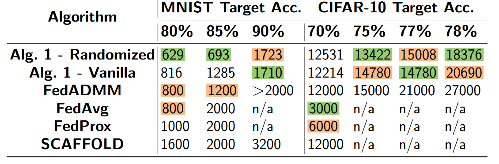
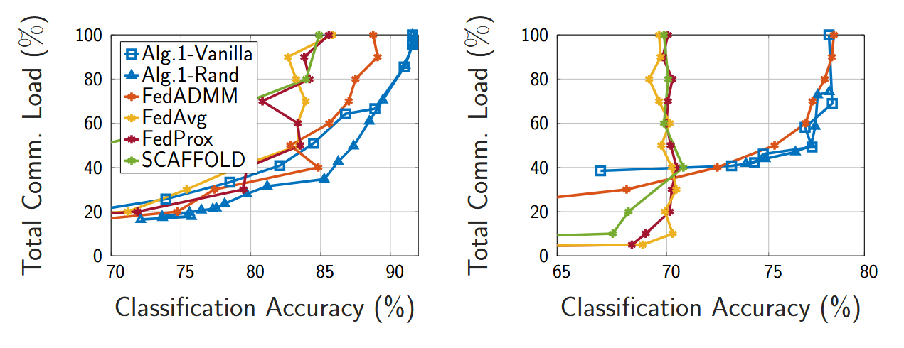

# Distributed Event-Based Learning via ADMM
We introduce an event-triggered communication protocol for distributed learning, built on the ADMM framework. Instead of communicating at every iteration, each agent transmits updates only when significant changes occur. This approach cuts down communication without sacrificing convergence or accuracy, and is resilient to heterogeneous data across agents. The algorithm supports convex and nonconvex objectives and accommodates a wide range of learning problems.

This work was conducted by [Güner Dilsad Er](https://guner-dilsad-er.github.io/) and  [Michael Muehlebach](https://sites.google.com/view/mmuehlebach/) at the [Max-Planck Institute for Intelligent Systems](https://is.mpg.de/lds/), and [Sebastian Trimpe](https://www.dsme.rwth-aachen.de/cms/dsme/das-institut/team/~jlolt/prof-sebastian-trimpe/?allou=1) at [RWTH Aachen University](https://www.dsme.rwth-aachen.de/cms/~ibtrg/DSME/). The paper has been accepted to ICML 2025 and is available on [arXiv](https://arxiv.org/abs/2405.10618).

The authors also thank Michael Cummins for his valuable contribution to the codebase.

## Highlights

  - Event-triggered ADMM: Communication occurs only when necessary, reducing overhead by over 35% on benchmark tasks.

  - Global convergence: Proven linear rates in strongly convex settings and sublinear rates in general nonconvex problems.

  - Robustness to failures: The method remains stable under packet drops, aided by a simple periodic reset mechanism.

  - Strong baseline performance: Outperforms FedAvg, FedProx, SCAFFOLD, and FedADMM in both accuracy and communication efficiency.

## Results
Our experiments on MNIST and CIFAR-10 confirm that our method achieves target accuracy with fewer communication rounds. The method remains effective even in extreme data heterogeneity, such as one-class-per-agent scenarios.

### Total communication events to reach accuracy targets:


### Validation accuracy vs. communication rounds:


## Getting Started

To set up the environment:
```
pip install -r requirements_pip.txt
```
OR

Using Conda:
```
conda create --name event-admm --file requirements_conda.txt
conda activate event-admm
```
Create the folders:
```
mkdir experiments/data
mkdir experiments/data/cifar10
mkdir experiments/data/mnist_data
```

## Run the experiments
```
python main.py [--mnist | --cifar] [--avg | --prox | --admm | --scaffold | --event] [options]
```
## Method Flags
```
  --avg: Run FedAvg
  --prox: Run FedProx
  --admm: Run FedADMM
  --scaffold: Run SCAFFOLD
  --event: Run Event-Based ADMM (requires --delta)
```

## Common Options
```
  --rate: Participation rate (e.g. 0.1 means 10%)
  --delta: Event threshold (only for Event-Based ADMM)
  --comp_rate: Computation rate (optional for Event-Based ADMM)
  --seed: Random seed
```

## Examples:

### FedAvg on CIFAR-10 with full participation:

```
python main.py --cifar --avg --rate 1.0 --seed 42
```

### Event-based ADMM on MNIST with threshold Δ = 2:

```
python main.py --mnist --event --delta 2.0 --seed 42
```

## Result Tracking (Optional)

We recommend using Weights & Biases (wandb) to log metrics, visualize training progress, and manage experiments efficiently.

  -  To enable it, install the package:
    ```
    pip install wandb
    ```
  -  Set your WandB API key in ```main.py```.

  -  Uncomment and fill in ```wandb.init``` in ```main.py```.

  -  Uncomment the lines with ```wandb.log(...)``` in ```server.py```.

## Citing

```
@article{er2025disteventbased,
  title={Distributed Event-Based Learning via ADMM},
  author={Er, Guner Dilsad and Trimpe Sebastian and Muehlebach, Michael},
  journal={arXiv preprint arXiv:2405.10618},
  year={2024}
}
```


